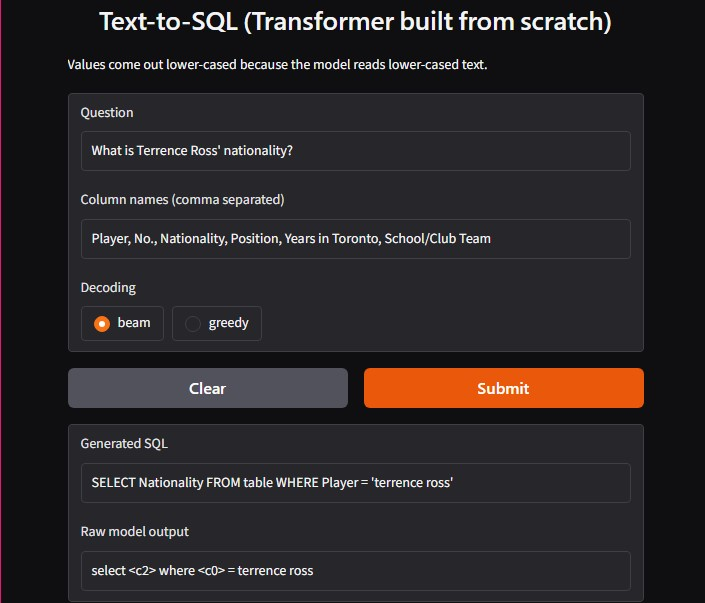
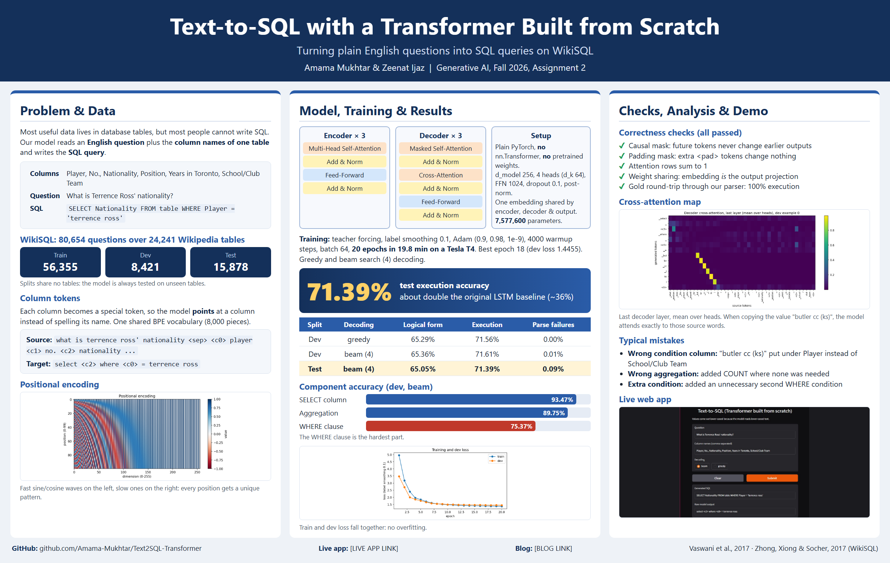

# Text-to-SQL with a Transformer built from scratch (WikiSQL)

Generative AI, Fall 2026, Assignment 2. An English question + the column names of a table go in, a SQL query comes out.
The encoder-decoder Transformer from *Attention Is All You Need* is written by us in plain PyTorch
(no `nn.Transformer`, no `nn.MultiheadAttention`, no pretrained weights) and trained once from random init.

**Team:** Amama Mukhtar and Zeenat Ijaz &nbsp;|&nbsp; **Blog:** <medium link> &nbsp;|&nbsp; **LinkedIn:** <post link>

## Repo layout

| path | what is inside |
|---|---|
| `starter/` | the given files (data prep, tokenizer, dataset, embeddings, check_starter) |
| `model/attention.py` | scaled dot-product attention + multi-head attention |
| `model/layers.py` | feed-forward, encoder layer, decoder layer |
| `model/transformer.py` | padding / causal masks and the full model |
| `train.py` | training (teacher forcing, label smoothing, Adam, warmup schedule) |
| `decode.py` | greedy decoding, beam search (4), parser, readable SQL |
| `evaluate_model.py` | prediction files, official metrics, component accuracy, attention map, samples |
| `checks.py`, `make_figures.py` | correctness checks, figures + Table 1 |
| `app/app.py` | Gradio front end |
| `results/` | prediction files, tables, figures, `samples.md` |

## How to run everything (from the repo root, Colab/Kaggle GPU)

```bash
pip install torch sentencepiece records babel tqdm tabulate gradio matplotlib
git clone https://github.com/salesforce/WikiSQL && (cd WikiSQL && tar xjf data.tar.bz2)

python starter/data_prep.py          # writes train/dev/test_pairs.jsonl
python starter/tokenizer.py          # writes sql_sp.model (shared BPE, 8000 pieces)
python starter/check_starter.py      # shapes check

python train.py --ckpt-dir checkpoints          # 20 epochs, resumes automatically if interrupted
python make_figures.py                          # PE heat-map, LR schedule, loss curves, Table 1
python checks.py --ckpt checkpoints/best.pt > results/checks.txt
python evaluate_model.py dev  --ckpt checkpoints/best.pt            # greedy + beam on dev, everything else
python evaluate_model.py test --ckpt checkpoints/best.pt --decode beam   # test set, run ONCE
CKPT=checkpoints/best.pt python app/app.py      # front end
```

Model config: d_model 256, 4 heads (d_k = d_v = 64), 3 encoder + 3 decoder layers, d_ff 1024, dropout 0.1,
post-norm, one weight matrix shared by encoder embedding, decoder embedding and output projection.
Adam (0.9, 0.98, 1e-9), warmup 4000, label smoothing 0.1, batch 64, 20 epochs.

## Correctness checks

```
trainable params: 7577600
causal mask ok: True
padding mask ok: True
decoder cross-attn rows sum to 1: True
encoder self-attn rows sum to 1: True
weight sharing ok: True
```

Gold round-trip (dev gold targets -> our parser -> official evaluator): logical form 100.0%, execution 100.0%, parse failures 0.0%.

## Results

### Table 1 - Data (lengths include `<s>` and `</s>`)

| | Train | Dev | Test |
|---|---|---|---|
| Pairs | 56,355 | 8,421 | 15,878 |
| Mean / max source length | 42.5 / 222 | 42.5 / 167 | 42.7 / 260 |
| Mean / max target length | 14.8 / 65 | 14.8 / 44 | 14.9 / 46 |
| Pairs dropped as too long | 19 | 0 | 0 |

### Table 2 - Model and training

- Trainable parameters: 7,577,600
- Epochs trained / best epoch: 20 / 18
- Best dev loss: 1.4455 (label smoothing 0.1, so not an accuracy)
- Training time and GPU: 19.8 min on Tesla T4

### Table 3 - Official metrics

| Split | Decoding | Logical form (%) | Execution (%) | Parse failures (%) |
|---|---|---|---|---|
| Dev | greedy | 65.29 | 71.56 | 0.00 |
| Dev | beam (4) | 65.36 | 71.61 | 0.01 |
| Test | beam (4) | 65.05 | 71.39 | 0.09 |

Beam was used for the test set because it was (very slightly) better on dev. The test set was run once.

### Table 4 - Component accuracy (dev)

| Decoding | SELECT column | Aggregation | WHERE clause |
|---|---|---|---|
| greedy | 93.40% | 89.76% | 75.19% |
| beam (4) | 93.47% | 89.75% | 75.37% |

### Attention check

Over the first 200 dev examples, 48 of 422 generated column tokens (11.4%) put their strongest last-layer cross-attention (mean over heads) inside the matching source column. We did not investigate why it is low.

Figures (all in `results/`): `pe_heatmap.png`, `loss_curves.png`, `lr_schedule.png`, `attention_map.png`, front-end screenshot below.



Ten qualitative dev examples (5 right, 5 wrong): `results/samples.md`.

## Poster and video



NotebookLM video overview: https://youtu.be/bQhbvAQq-e0

## Notes / limitations

- Values are lower-cased (the starter code lower-cases everything), the official evaluator compares them case-insensitively.
- Only train drops over-long pairs; dev and test keep every row in file order.
- Single training run, no hyper-parameter search.
